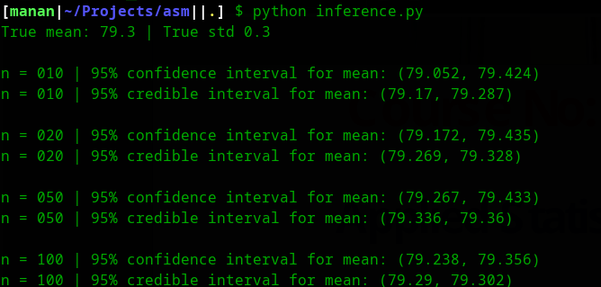
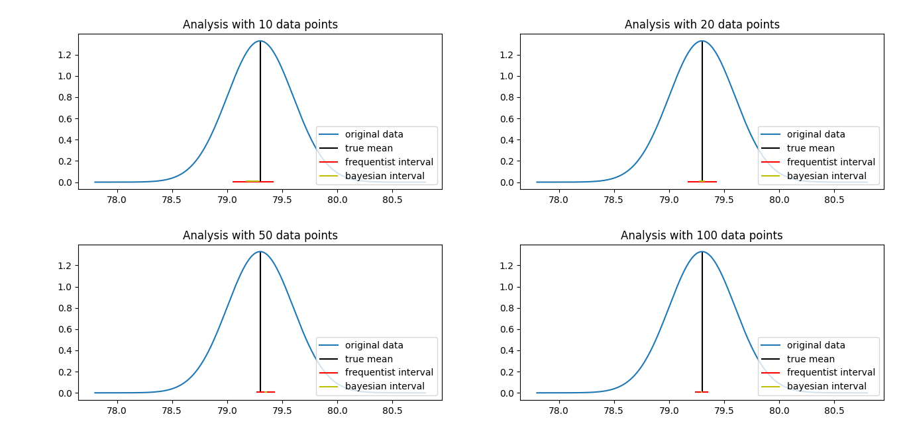

# ASM-Bayes
code for the assignment 1 of the course Applied Statistical Methods (Baye's group)

## Output
Their results are shown in the figure given below. The blue curve represents the distribution of the original data (with a mean of 79.3 and a standard deviation of 0.3) while the red and yellow lines represent 95% confidence intervals for the frequentist and bayesian approaches respectively.

